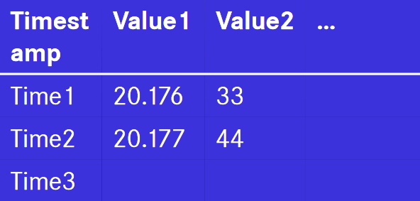

# InfluxDB
In this scenario you'll learn how to install and use the open-source time series database InfluxDB.

A time series database are based on Key-Value pairs where the key will be a timestamp. This is especially useful for usecases where you are monitoring data over time[[1]](https://github.com/influxdata/influxdb).
This is what a table in a timeseries database could look like:

[Andreas Buckenhofer,2022, Buckenhofer-DWH04-Tools, Slide 50](https://elearning.dhbw-stuttgart.de/moodle/pluginfile.php/452774/mod_resource/content/1/Buckenhofer-DWH04-Tools.pdf)

Data is identified by the timestamp and contains all the data connected to the specific timestamp.

The scenario will first focus on the installation and setup of an instance of InfluxDB and telegraf.

>  Telegraf is a server-based agent for collecting and sending all metrics and events from databases, systems, and IoT sensors. [[2]](https://www.influxdata.com/time-series-platform/telegraf/). 

After the setup is complete, you will learn how to integrate basic system monitoring with telegraf into the database. While exploring the possibilites you will learn why this makes sense and what usecases can profit from the time based design.